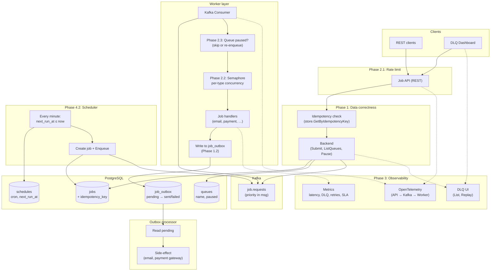
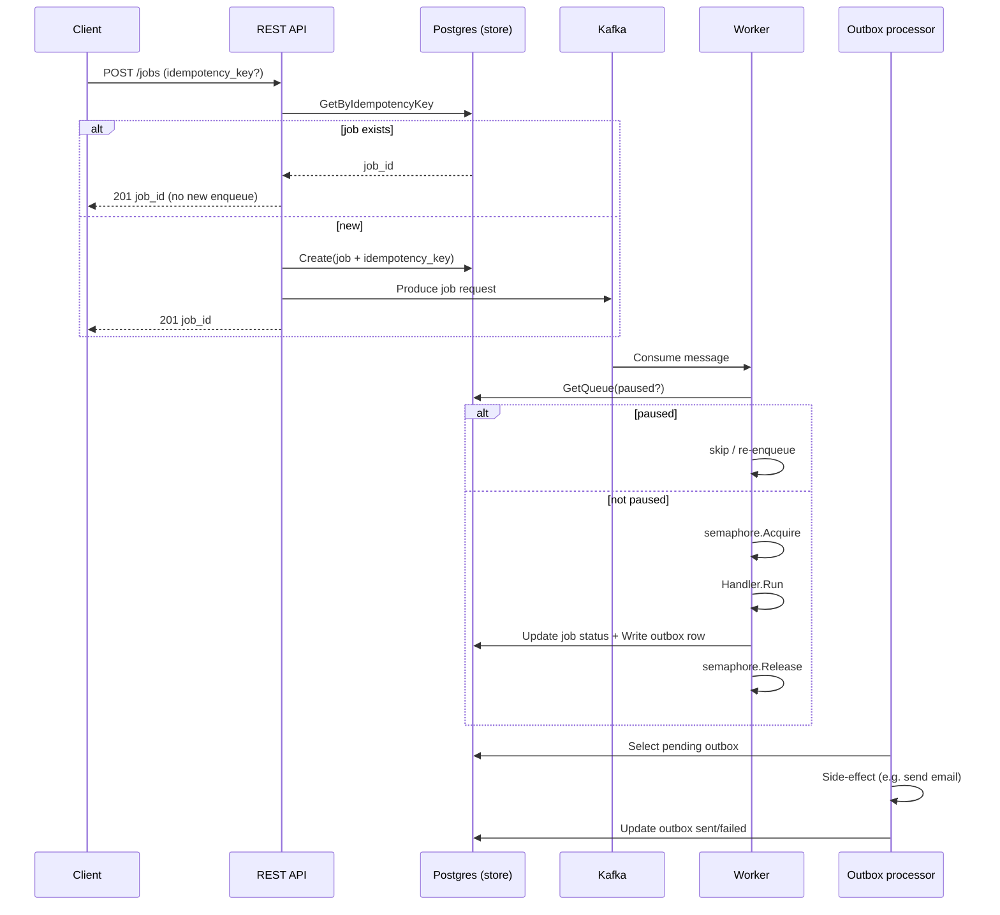
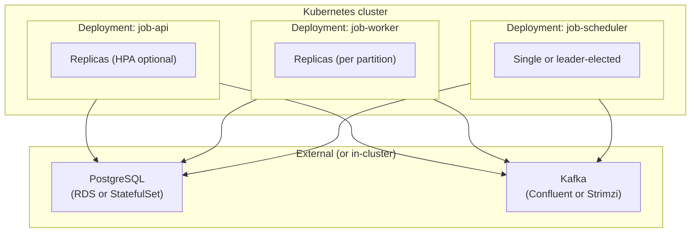

# Architecture Diagram — Fintech Production Features Plan

This diagram reflects the target architecture described in the [Fintech Production Features](c:\Users\likhi\.cursor\plans\fintech_production_features_42b4ad89.plan.md) plan (Phases 1–5).

---

## High-level architecture

---

## Component view (by phase)

```mermaid
flowchart LR
    subgraph Phase1["Phase 1: Data correctness"]
        P1A["Idempotency\n(key → return existing ID)"]
        P1B["Outbox table\n+ processor"]
    end

    subgraph Phase2["Phase 2: Reliability"]
        P2A["Rate limit\n(API 429)"]
        P2B["Worker semaphore\n(per-type)"]
        P2C["Queues table\n+ Pause/Unpause"]
    end

    subgraph Phase3["Phase 3: Observability"]
        P3A["Tracing\n(OTel)"]
        P3B["Metrics\n(latency, DLQ, SLA)"]
        P3C["DLQ UI\n(List, Replay)"]
    end

    subgraph Phase4["Phase 4: Product"]
        P4A["Priority\n(worker ordering)"]
        P4B["Recurring\n(schedules + cron)"]
        P4C["SLA breach\n(metric + event)"]
    end

    subgraph Phase5["Phase 5: Ops"]
        P5A["K8s manifests"]
        P5B["Drain\n(graceful stop)"]
    end

    Phase1 --> Phase2 --> Phase3 --> Phase4 --> Phase5
```

---

## Data flow (submit → process → outbox)

---

## Deployment (Phase 5.1 — Kubernetes)

---

## Legend

| Symbol / area | Meaning |
|---------------|---------|
| **Phase 1** | Idempotency (store + API); Outbox table + processor for exactly-once side-effects |
| **Phase 2** | Rate limit (API); Worker semaphore; Queues table + Pause/Unpause + worker check |
| **Phase 3** | OpenTelemetry tracing; Richer metrics; DLQ UI (list/retry from dashboard) |
| **Phase 4** | Job priority (Kafka/worker); Recurring jobs (schedules + scheduler); SLA breach metric/event |
| **Phase 5** | Kubernetes manifests for API, worker, scheduler; Worker drain for safe rollouts |

To render the Mermaid diagrams, use a Markdown viewer with Mermaid support (e.g. GitHub, GitLab, VS Code with Mermaid extension) or [Mermaid Live Editor](https://mermaid.live).
